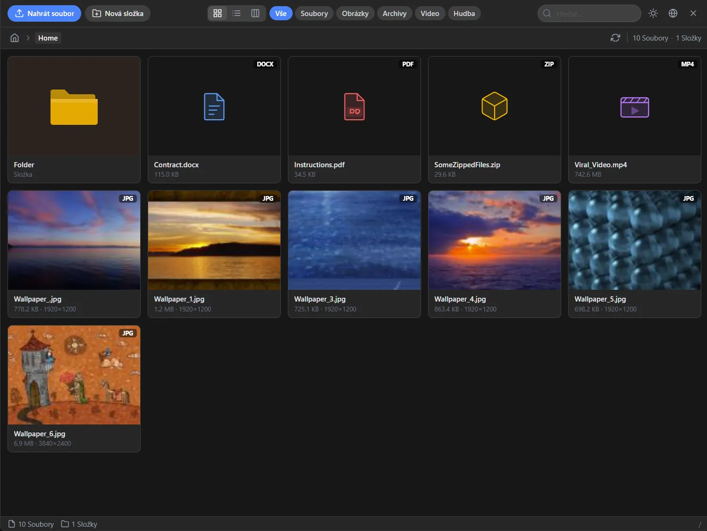
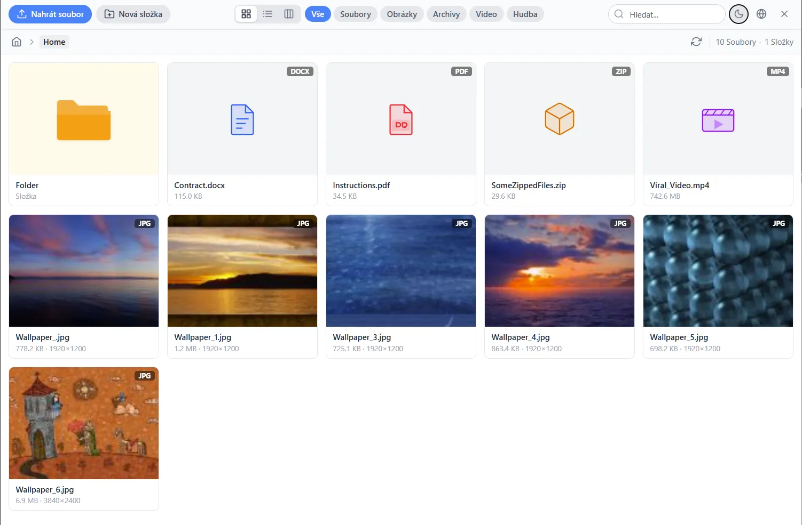
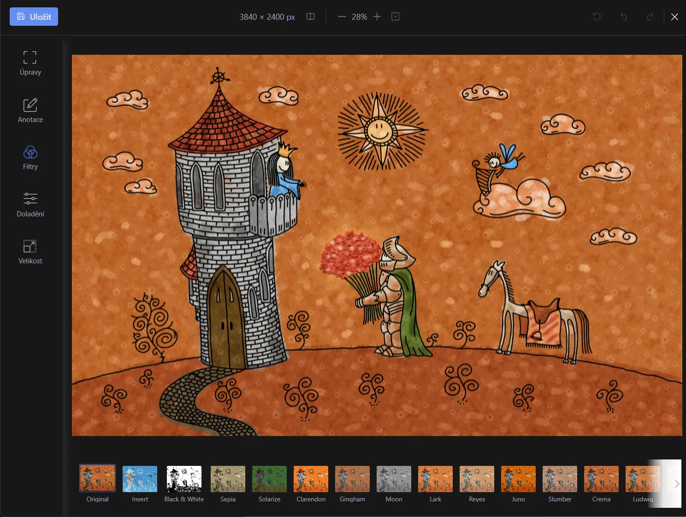

# File Image Manager

Modern, responsive web file manager built with **Vue 3 + TypeScript** frontend and **PHP 8.5** backend. Supports light/dark themes, drag & drop uploads, image editing (Filerobot), and integration with TinyMCE 8 / CKEditor 5. Includes a ready-to-use TinyMCE plugin. No database required.

Developed by **[Radek Hulán](https://mywebdesign.dev/)**
with the amazing assistance of [Claude Code](https://claude.ai/claude-code).

**[Quick Start (Deploy)](#quick-start)** | **[What to Deploy](#what-to-deploy)** | **[Security](#security)** | **[Configuration](#configuration)** | **[Editor Integration](#editor-integration)**

### Dark Theme


### Light Theme


> [!CAUTION]
> **The file manager does NOT include built-in authentication.** Without protection, anyone with the URL can upload, delete, and modify files on your server. You **must** secure it before deploying to production. See [Security](#security) below.

---

## Quick Start

### Linux / macOS
```bash
chmod +x deploy.sh && ./deploy.sh
```

### Windows (PowerShell)
```powershell
.\deploy.ps1
```

### Manual Installation
```bash
composer install --no-dev --optimize-autoloader
npm ci && npm run build
mkdir -p media/source media/thumbs
chmod 755 media/source media/thumbs
# Point your web server document root to the public/ directory
```

---

## Security

> [!CAUTION]
> Every item below is critical. Skipping any of them exposes your server to unauthorized file access, uploads, or remote code execution.

### 1. Authentication (required)

**Session-based (recommended):** Wrap the file manager in your application's auth layer. Start a PHP session and set `$_SESSION['authenticated'] = true` before including the file manager. The built-in `AuthMiddleware` checks for an active session.

**Access keys (simple alternative):** For deployments without a session system:
```php
'use_access_keys' => true,
'access_keys'     => ['your-random-secret-key'],
```
Then open `?key=your-random-secret-key`.

### 2. CSRF Protection
Enabled by default. The frontend sends `X-CSRF-Token` with every API request. **Do not disable this.**

### 3. Extension Blacklist
The default `ext_blacklist` blocks PHP, scripts, executables, and server config files. **Never remove entries** from it. Extend it if needed.

### 4. Config File Access
`config/filemanager.php` contains sensitive settings.
- **Linux:** `chmod 640 config/filemanager.php`
- **IIS:** Remove read access for anonymous users.

### 5. HTTPS
Always serve over HTTPS in production. The `.htaccess` / `web.config` files set security headers (`X-Content-Type-Options`, `X-Frame-Options`) but cannot enforce HTTPS.

### 6. Path Traversal Protection
The backend validates all paths using `realpath()`. Never bypass these checks.

---

## Requirements

| Component | Version |
|-----------|---------|
| PHP | >= 8.5 (`gd`, `mbstring`, `json`, `curl`, `fileinfo`) |
| Composer | 2.x |
| Node.js | >= 20 (build only) |
| npm | >= 10 (build only) |
| Web server | Apache (mod_rewrite), IIS (URL Rewrite), or Nginx |

---

## Configuration

All options are in `config/filemanager.php` with inline documentation.

### Paths

| Option | Default | Description |
|--------|---------|-------------|
| `base_url` | auto-detected | Base URL (e.g. `https://example.com`) |
| `upload_dir` | `/source/` | URL path to uploaded files |
| `thumbs_upload_dir` | `/thumbs/` | URL path to thumbnails |
| `current_path` | `../source/` | Filesystem path to uploads (relative to `public/`) |
| `thumbs_base_path` | `../thumbs/` | Filesystem path to thumbnails |

### Upload

| Option | Default | Description |
|--------|---------|-------------|
| `MaxSizeUpload` | `10` | Max upload size in MB |
| `MaxSizeTotal` | `false` | Max total folder size in MB (`false` = unlimited) |
| `mime_extension_rename` | `true` | Auto-rename extensions based on MIME type |
| `filePermission` | `0644` | Default file permissions (Linux) |
| `folderPermission` | `0755` | Default folder permissions (Linux) |

### Permissions

| Option | Default | Description |
|--------|---------|-------------|
| `delete_files` | `true` | Allow deleting files |
| `create_folders` | `true` | Allow creating folders |
| `delete_folders` | `true` | Allow deleting folders |
| `upload_files` | `true` | Allow uploading files |
| `rename_files` | `true` | Allow renaming files |
| `rename_folders` | `true` | Allow renaming folders |
| `duplicate_files` | `true` | Allow duplicating files |
| `extract_files` | `false` | Allow extracting ZIP/GZ/TAR archives |
| `copy_cut_files` | `true` | Allow copy/cut/paste for files |
| `copy_cut_dirs` | `true` | Allow copy/cut/paste for directories |
| `chmod_files` | `false` | Show chmod dialog for files |
| `chmod_dirs` | `false` | Show chmod dialog for directories |
| `download_files` | `true` | Allow downloading files |
| `url_upload` | `false` | Allow uploading from URL |
| `edit_text_files` | `false` | Allow editing text files |
| `create_text_files` | `false` | Allow creating text files |

### UI

| Option | Default | Description |
|--------|---------|-------------|
| `default_language` | `en_EN` | Default language code |
| `default_view` | `0` | Default view (0 = Grid, 1 = List, 2 = Columns) |
| `dark_mode` | `true` | Dark mode support (respects system preference) |
| `show_sorting_bar` | `true` | Show sort bar in list/columns view |
| `show_filter_buttons` | `true` | Show file type filter buttons |
| `show_language_selection` | `true` | Show language selector |
| `multiple_selection` | `true` | Allow multi-file selection |

### Image Processing

| Option | Default | Description |
|--------|---------|-------------|
| `image_max_width` | `0` | Max image width (0 = no limit) |
| `image_max_height` | `0` | Max image height (0 = no limit) |
| `image_resizing` | `false` | Auto-resize uploaded images |
| `image_resizing_width` | `0` | Resize width |
| `image_resizing_height` | `0` | Resize height |
| `image_resizing_mode` | `auto` | `auto`, `exact`, `portrait`, `landscape`, `crop` |
| `image_watermark` | `false` | Path to watermark image or `false` |
| `image_editor_active` | `true` | Enable Filerobot image editor |

### Allowed Extensions

| Option | Default |
|--------|---------|
| `ext_img` | `jpg, jpeg, png, gif, bmp, svg, ico, webp` |
| `ext_file` | `doc, docx, xls, xlsx, pdf` |
| `ext_video` | `mov, mpeg, m4v, mp4, avi, mpg, wma, flv, webm` |
| `ext_music` | `mp3, mpga, m4a, ac3, aiff, mid, ogg, wav` |
| `ext_misc` | `zip, rar, gz, tar` |

### Google Docs Preview

| Option | Default | Description |
|--------|---------|-------------|
| `googledoc_enabled` | `true` | Use Google Docs Viewer for office files |
| `googledoc_file_exts` | `doc, docx, xls, xlsx, ppt, pptx, pdf, odt, odp, ods` | Extensions to preview via Google |

> [!NOTE]
> Google Docs Viewer requires the file to be **publicly accessible** from the internet. It will not work on localhost or intranet servers.

---

## Editor Integration

### TinyMCE 8 (Plugin)

The included TinyMCE plugin (`public/tinymce/plugin.js`) provides the simplest integration. It automatically registers a toolbar button and sets up `file_picker_callback` for native image/media/link dialogs.

```html
<script src="https://cdnjs.cloudflare.com/ajax/libs/tinymce/8.1.2/tinymce.min.js"></script>
<script>
tinymce.init({
    selector: '#editor',
    license_key: 'gpl',

    plugins: 'image media link code',
    toolbar: 'undo redo | blocks | bold italic | image media link | fileimagemanager | code',

    external_plugins: {
        fileimagemanager: '/public/tinymce/plugin.js'
    },

    relative_urls: false
});
</script>
```

**Plugin options** (all optional):

| Option | Default | Description |
|--------|---------|-------------|
| `fileimagemanager_url` | auto-detected | File manager URL (e.g. `/public/`) |
| `fileimagemanager_crossdomain` | `false` | Enable cross-domain postMessage mode |
| `fileimagemanager_title` | `File Image Manager` | Dialog title |

**Behavior:**

- **Toolbar button** (`fileimagemanager`): opens the file manager dialog. Clicking a file inserts it into the editor.
- **Image/media/link dialogs**: the browse button in TinyMCE native dialogs opens the file manager via `file_picker_callback`.
- **Smart insertion**: if text or an image is selected in the editor, the chosen file is inserted as a link (`<a>`) wrapping the selection. Without selection, images insert as ``, videos as `<video>`, audio as `<audio>`, and other files as `<a>` links.
- **Preview**: the eye icon on file hover always shows a preview, even in editor mode.
- **Relative URLs**: absolute URLs from the file manager are automatically converted to relative paths.

### TinyMCE 8 (Manual)

If you prefer not to use the plugin, you can integrate manually via `file_picker_callback`:

```javascript
tinymce.init({
    selector: '#editor',
    plugins: 'image media link',
    toolbar: 'image media link',
    file_picker_types: 'file image media',
    file_picker_callback: function (callback, value, meta) {
        var url = '/public/?editor=tinymce&popup=1&crossdomain=0';
        window.addEventListener('message', function handler(e) {
            if (e.data && e.data.sender === 'fileimagemanager') {
                window.removeEventListener('message', handler);
                callback(e.data.url, { alt: '' });
            }
        });
        tinymce.activeEditor.windowManager.openUrl({
            title: 'File Manager',
            url: url,
            width: window.innerWidth - 20,
            height: window.innerHeight - 40
        });
    },
    relative_urls: false
});
```

### CKEditor 5

Uses CKEditor 5 classic build v41.4.2 (last version without mandatory license key for CDN):

```html
<script src="https://cdn.ckeditor.com/ckeditor5/41.4.2/classic/ckeditor.js"></script>
<script>
ClassicEditor
    .create(document.querySelector('#editor'), {
        removePlugins: ['CKFinder', 'CKFinderUploadAdapter'],
        toolbar: ['heading', '|', 'bold', 'italic', 'link', 'bulletedList',
                  'numberedList', '|', 'outdent', 'indent', '|', 'blockQuote',
                  'insertTable', 'mediaEmbed', 'undo', 'redo']
    })
    .then(function (editor) {
        // Add a "Browse Server" button
        var button = document.createElement('button');
        button.textContent = 'Browse Server';
        button.addEventListener('click', function () {
            var url = '/public/?editor=ckeditor&popup=1&crossdomain=0';
            window.addEventListener('message', function handler(e) {
                if (e.data && e.data.sender === 'fileimagemanager') {
                    window.removeEventListener('message', handler);
                    var fileUrl = e.data.url;
                    editor.model.change(function (writer) {
                        var img = writer.createElement('imageBlock', { src: fileUrl });
                        editor.model.insertContent(img);
                    });
                }
            });
            window.open(url, 'fim', 'width=1200,height=800');
        });
        editor.ui.element.parentNode.insertBefore(button, editor.ui.element);
    });
</script>
```

### CKEditor 4 (Legacy)

```javascript
CKEDITOR.config.filebrowserBrowseUrl = '/public/?editor=ckeditor&popup=1';
CKEDITOR.config.filebrowserImageBrowseUrl = '/public/?editor=ckeditor&popup=1';
```

### Standalone (popup)

Open the file manager in a popup window. Single click shows a preview, double click selects the file:

```javascript
var popup = window.open(
    '/public/?popup=1',
    'fileimagemanager',
    'width=1200,height=900'
);

window.addEventListener('message', function handler(e) {
    if (e.data && e.data.sender === 'fileimagemanager') {
        window.removeEventListener('message', handler);
        console.log('Selected file:', e.data.url);
        popup.close();
    }
});
```

### PostMessage API

All integrations communicate via `window.postMessage`. The file manager sends:

```javascript
{ sender: 'fileimagemanager', url: '/source/path/to/file.jpg' }
```

| URL parameter | Description |
|---------------|-------------|
| `popup=1` | Enable popup/editor mode (single click = preview, double click = select) |
| `editor=tinymce` | TinyMCE mode (single click = select file immediately) |
| `editor=ckeditor` | CKEditor mode |
| `crossdomain=1` | Use `*` as postMessage target origin |
| `field_id=elementId` | Set value of a DOM input element |
| `callback=functionName` | Call a global function with the URL |

---

## Web Server Configuration

### Apache

The `public/.htaccess` handles URL rewriting. Enable `mod_rewrite`:

```bash
a2enmod rewrite && systemctl restart apache2
```

```apache
<VirtualHost *:80>
    ServerName filemanager.example.com
    DocumentRoot /var/www/filemanager/public
    <Directory /var/www/filemanager/public>
        AllowOverride All
        Require all granted
    </Directory>
</VirtualHost>
```

### IIS

Install the **URL Rewrite** module. Point the site to `public/`. The `public/web.config` handles rewriting.

### Nginx

```nginx
server {
    listen 80;
    server_name filemanager.example.com;
    root /var/www/filemanager/public;
    index index.php;

    location / {
        try_files $uri $uri/ /index.php?$query_string;
    }

    location ~ \.php$ {
        fastcgi_pass unix:/run/php/php8.5-fpm.sock;
        fastcgi_param SCRIPT_FILENAME $realpath_root$fastcgi_script_name;
        include fastcgi_params;
    }

    location ~* \.(js|css|png|jpg|jpeg|gif|ico|svg|woff2?)$ {
        expires 30d;
        add_header Cache-Control "public, immutable";
    }
}
```

---

## Production Deployment

### What to deploy

```
production-server/
├── config/filemanager.php     # Edit for your environment
├── lang/*.json                # Translation files
├── public/                    # <- Web server document root
│   ├── assets/                # Built JS/CSS (npm run build)
│   ├── tinymce/plugin.js      # TinyMCE plugin
│   ├── index.php
│   ├── .htaccess
│   └── web.config
├── src/                       # PHP backend
├── vendor/                    # Composer dependencies (no-dev)
└── composer.json
```

**Do NOT deploy:** `frontend/`, `node_modules/`, `tests/`, `package*.json`, `vite.config.ts`, `tsconfig.json`, `vitest.config.ts`, `phpunit.xml`, `.git/`

### Linux / macOS

```bash
# Build
composer install --no-dev --optimize-autoloader && composer dump-autoload -o
npm install --legacy-peer-deps && npm run build

# Copy to server
rsync -av --exclude='frontend/' --exclude='node_modules/' --exclude='tests/' \
  --exclude='package*.json' --exclude='vite.config.ts' --exclude='tsconfig.json' \
  --exclude='vitest.config.ts' --exclude='phpunit.xml' --exclude='.git/' \
  ./ user@server:/var/www/filemanager/

# On the server
mkdir -p /var/www/source /var/www/thumbs
chown www-data:www-data /var/www/source /var/www/thumbs
```

### Windows / IIS

```powershell
# Build
composer install --no-dev --optimize-autoloader
npm install --legacy-peer-deps && npm run build

# Copy to IIS
robocopy . C:\inetpub\filemanager /MIR /XD frontend node_modules tests .git `
  /XF package*.json vite.config.ts tsconfig.json vitest.config.ts phpunit.xml

# In IIS Manager: create site -> physical path: C:\inetpub\filemanager\public
# Grant IIS_IUSRS Modify permission on source/ and thumbs/
```

### Production config

```php
'base_url'        => 'https://example.com',
'upload_dir'      => '/source/',
'current_path'    => '../source/',
'thumbs_base_path'=> '../thumbs/',
'use_access_keys' => true,
'access_keys'     => ['your-random-secret-key'],
'MaxSizeUpload'   => 10,
```

### Troubleshooting

| Problem | Check |
|---------|-------|
| Blank page | `public/assets/.vite/manifest.json` exists? |
| 500 error | PHP error log, missing extensions? |
| Autoload error | `vendor/autoload.php` exists? Run `composer install` |
| 404 on API | URL Rewrite module installed? (Apache: `mod_rewrite`, IIS: URL Rewrite) |

---

## Keyboard Shortcuts

| Shortcut | Action |
|----------|--------|
| `Ctrl+A` | Select all files |
| `Ctrl+C` | Copy selected |
| `Ctrl+X` | Cut selected |
| `Ctrl+V` | Paste |
| `Delete` | Delete selected |
| `F2` | Rename |
| `F5` | Refresh |
| `Backspace` | Go to parent directory |
| `Escape` | Close overlay / menu |

---

## Available Languages

`en_EN` English, `cs` Cestina, `de` Deutsch, `hr` Hrvatski, `hu_HU` Magyar, `it` Italiano, `sk` Slovencina, `sl` Slovenscina

---

## Development

```bash
# Install with dev dependencies
./deploy.sh --dev        # Linux/macOS
.\deploy.ps1 -Dev        # Windows

# Vite dev server with HMR
npm run dev

# PHP built-in server (separate terminal)
php -S localhost:80 -t public/

# Production build
npm run build

# Type check
npm run lint
```

## Testing

245 tests across PHPUnit (PHP) and Vitest (frontend).

```bash
./test.sh                # All tests (Linux/macOS)
.\test.ps1               # All tests (Windows)
./test.sh php            # PHP only
./test.sh frontend       # Frontend only
npm test                 # Vitest
php vendor/bin/phpunit   # PHPUnit
```

---

## API Reference

All endpoints return JSON. Prefix: `/api/`

### Session & Config
| Method | Endpoint | Description |
|--------|----------|-------------|
| `POST` | `/api/config/init` | Initialize session, get config + translations |
| `GET` | `/api/config` | Get current config |
| `GET` | `/api/config/languages` | List available languages |
| `POST` | `/api/config/language` | Change language |
| `POST` | `/api/config/view` | Change view mode |
| `POST` | `/api/config/sort` | Change sort field/direction |
| `POST` | `/api/config/filter` | Change type filter |

### Files & Folders
| Method | Endpoint | Description |
|--------|----------|-------------|
| `GET` | `/api/files` | List directory contents |
| `GET` | `/api/files/info` | Get file info |
| `GET` | `/api/files/download` | Download file (range requests supported) |
| `GET` | `/api/files/preview` | Get preview data |
| `GET` | `/api/files/content` | Get text file content |
| `POST` | `/api/folders/create` | Create folder |
| `POST` | `/api/folders/rename` | Rename folder |
| `POST` | `/api/folders/delete` | Delete folder |

### Operations
| Method | Endpoint | Description |
|--------|----------|-------------|
| `POST` | `/api/operations/rename` | Rename file |
| `POST` | `/api/operations/delete` | Delete file |
| `POST` | `/api/operations/delete-bulk` | Delete multiple files |
| `POST` | `/api/operations/duplicate` | Duplicate file |
| `POST` | `/api/operations/copy` | Copy to clipboard |
| `POST` | `/api/operations/cut` | Cut to clipboard |
| `POST` | `/api/operations/paste` | Paste from clipboard |
| `POST` | `/api/operations/clear-clipboard` | Clear clipboard |
| `POST` | `/api/operations/chmod` | Change permissions |
| `POST` | `/api/operations/extract` | Extract archive |
| `POST` | `/api/operations/save-text` | Save text file |
| `POST` | `/api/operations/create-file` | Create text file |

### Upload & Image
| Method | Endpoint | Description |
|--------|----------|-------------|
| `POST` | `/api/upload` | Upload files (multipart) |
| `POST` | `/api/upload/url` | Upload from URL |
| `POST` | `/api/image/save` | Save edited image (base64) |

---

## Project Structure

```
.
├── config/filemanager.php        # Configuration (all options documented)
├── frontend/                     # Vue 3 SPA source
│   ├── api/                      #   Axios API client
│   ├── components/               #   Vue components
│   │   ├── common/               #     ContextMenu, LoadingOverlay
│   │   ├── dialogs/              #     Confirm, Prompt, Alert, Chmod, TextEditor, Language
│   │   ├── file-list/            #     FileGrid, FileList, FileColumns, FileItem
│   │   ├── layout/               #     AppHeader, Breadcrumb, SortBar, StatusBar
│   │   ├── preview/              #     ImagePreview, MediaPlayer, TextPreview, ImageEditor
│   │   └── upload/               #     UploadPanel, DropZone, UploadProgress, UrlUpload
│   ├── composables/              #   useKeyboard, useDragDrop
│   ├── plugins/                  #   TinyMCE 8 + CKEditor plugins
│   ├── stores/                   #   Pinia (config, file, ui, clipboard, upload)
│   ├── types/                    #   TypeScript definitions
│   └── utils/                    #   Utility functions
├── lang/*.json                   # Translations (8 languages)
├── public/                       # Web server document root
│   ├── assets/                   #   Built JS/CSS (npm run build)
│   ├── tinymce/plugin.js         #   TinyMCE plugin
│   ├── index.php                 #   Front controller
│   ├── .htaccess                 #   Apache rewrite
│   └── web.config                #   IIS rewrite
├── src/                          # PHP backend (PSR-4: RFM\)
│   ├── Config/                   #   AppConfig, ConfigLoader
│   ├── Controller/               #   Config, File, Folder, Upload, Operation, Image
│   ├── DTO/                      #   FileItem, BreadcrumbItem
│   ├── Enum/                     #   ViewType, SortField, FileCategory, ...
│   ├── Exception/                #   Forbidden, PathTraversal, FileNotFound, ...
│   ├── Http/                     #   Request, JsonResponse, StreamResponse
│   ├── Middleware/                #   AuthMiddleware, CsrfMiddleware
│   ├── Service/                  #   Security, FileSystem, Upload, Thumbnail, Image
│   ├── App.php                   #   Application bootstrap
│   └── Router.php                #   API routes
├── tests/                        # PHPUnit + Vitest
├── media/source/                 # Uploaded files (gitignored)
├── media/thumbs/                 # Generated thumbnails (gitignored)
├── build.sh / build.ps1         # Build distribution zip
├── deploy.sh / deploy.ps1       # Deploy scripts
└── test.sh / test.ps1           # Test runners
```

## Building Distribution Package

Build a ready-to-deploy `.zip` archive in the `dist/` directory:

```bash
./build.sh               # Linux / macOS / Git Bash
.\build.ps1              # Windows PowerShell
```

The script runs the full frontend build, installs production-only Composer dependencies, packages everything needed for deployment into `dist/fileimagemanager-v1.0.0.zip`, and restores dev dependencies afterwards.

---

## Technology Stack

| Layer | Technology |
|-------|-----------|
| Frontend | Vue 3.5, TypeScript, Vite 6, Tailwind CSS 4, Pinia 2.3 |
| Image Editor | Filerobot Image Editor 4.8 |
| Backend | PHP 8.5, GD library |
| Storage | Filesystem only (no database) |

### Image Editor


## License

[CC0 1.0 Universal](https://creativecommons.org/publicdomain/zero/1.0/) - Public Domain

